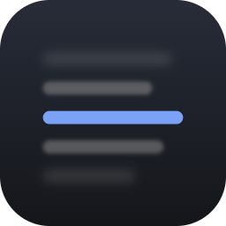
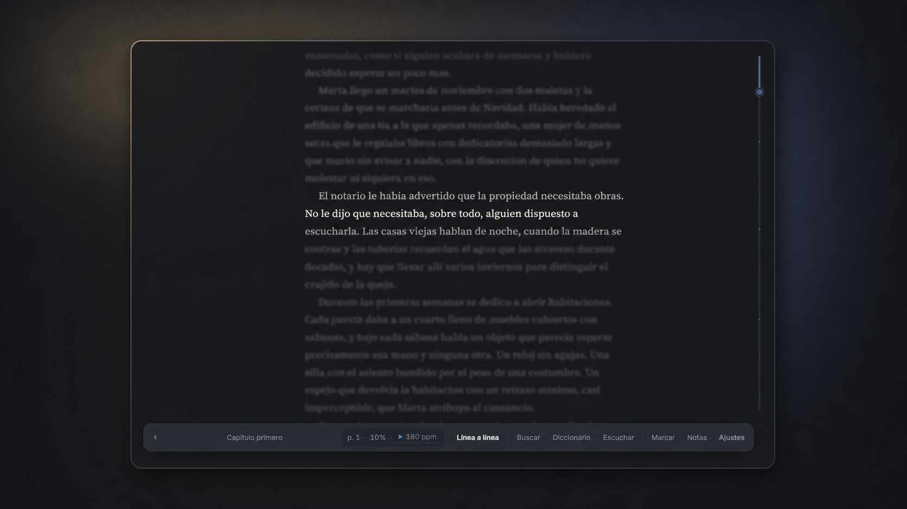
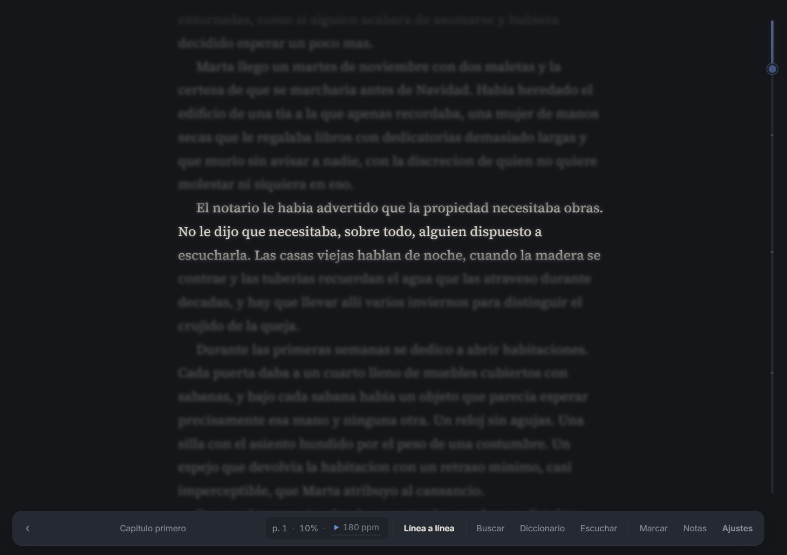
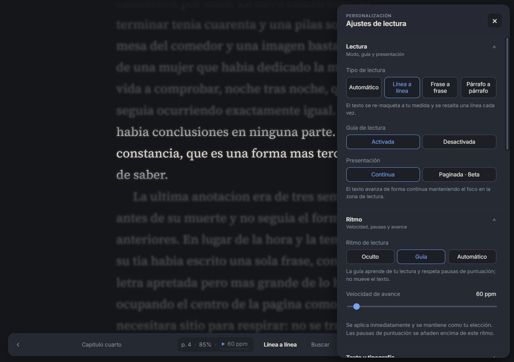
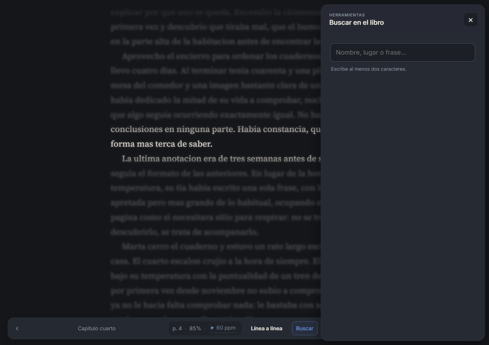
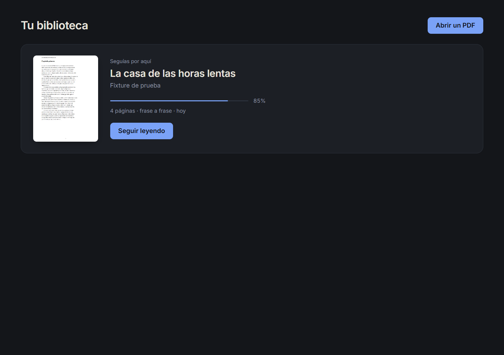
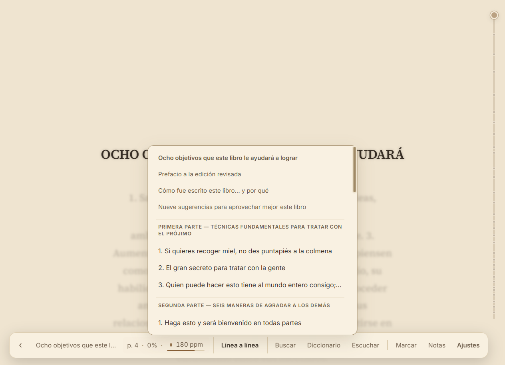
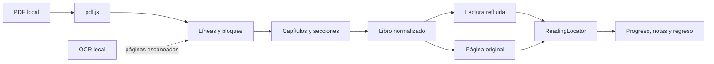

<div align="center">
  
  <h1>Lector</h1>
  <p><strong>Convierte novelas en PDF en una experiencia de lectura tranquila, enfocada y verdaderamente personal.</strong></p>
  <p>Un lector de escritorio local-first para Windows. Sin cuentas, sin telemetría y sin enviar tus libros a internet.</p>

  <p>
    <a href="https://github.com/gomezacero/lector/actions/workflows/ci.yml"></a>
    <a href="LICENSE"></a>
    <a href="https://github.com/gomezacero/lector/releases"></a>
    
    
  </p>

  <p>
    <a href="https://github.com/gomezacero/lector/releases/tag/v0.1.6"><strong>Descargar vista previa</strong></a>
    ·
    <a href="#qué-hace-diferente-a-lector">Descubrir Lector</a>
    ·
    <a href="docs/sdd/README.md">Ver el roadmap</a>
    ·
    <a href="CONTRIBUTING.md">Contribuir</a>
  </p>
</div>



> [!IMPORTANT]
> La versión `0.1.6` es una **vista previa pública sin firma digital**. Windows
> SmartScreen o una política corporativa pueden bloquearla. La integración con
> SignPath está en preparación; consulta la [política de firma](CODE_SIGNING_POLICY.md)
> y el [seguimiento público](https://github.com/gomezacero/lector/issues/4).

## Leer un PDF no debería sentirse como pelear con un PDF

Muchos libros digitales conservan márgenes, folios, encabezados, columnas y una
tipografía pensada para papel. Lector analiza el documento y reconstruye la
prosa como un e-reader, sin perder el vínculo con la página original. La guía
visual mantiene una línea o frase nítida mientras reduce el ruido alrededor;
su ritmo automático puede avanzar por ti y respetar las pausas del texto.

Todo sucede en tu equipo. El PDF, las notas, el progreso, el OCR, el diccionario
y la voz permanecen locales.

## Qué hace diferente a Lector

| 📖 Lectura reconstruida | 🎯 Atención sin perder contexto | 🔒 Privacidad real |
|---|---|---|
| Recompone párrafos, elimina folios repetidos, repara palabras con guion y detecta capítulos. | Guía por línea, frase o párrafo; flujo continuo o página refluida; avance manual o automático. | Sin cuentas ni telemetría. OCR, diccionario, voz, biblioteca y progreso funcionan localmente. |

| 🧭 Siempre sabes volver | 🖋️ Tu tipografía, tu ritmo | 🧱 Diseñado para resistir cambios |
|---|---|---|
| Busca, abre una nota o salta de capítulo y regresa al punto exacto con una pila de navegación. | Presets, tamaño, ancho, peso, espaciado, temas y ritmo por libro. | El progreso se ancla al texto, no al número de línea, para sobrevivir a cambios de layout y reprocesados. |

## Una experiencia construida alrededor de la lectura

<table>
  <tr>
    <td width="50%">
      
      <br><strong>Foco graduable</strong><br>
      Lee línea a línea, frase a frase o párrafo a párrafo sin perder el contexto que rodea tu posición.
    </td>
    <td width="50%">
      
      <br><strong>Ritmo y presentación a tu medida</strong><br>
      Ajusta la guía, la paginación, el avance automático, la tipografía y el confort desde un panel organizado.
    </td>
  </tr>
  <tr>
    <td width="50%">
      
      <br><strong>Buscar, saltar y volver</strong><br>
      Encuentra nombres, lugares o frases sin perder el punto desde el que comenzaste.
    </td>
    <td width="50%">
      
      <br><strong>Una biblioteca que recuerda</strong><br>
      Retoma cada libro con su modo, progreso, presentación y preferencias de lectura.
    </td>
  </tr>
</table>

<details>
<summary><strong>Ver el tema sepia</strong></summary>



</details>

## Capacidades

| Área | Incluido hoy |
|---|---|
| Lectura | Línea, frase, párrafo, página original y página refluida beta |
| Ritmo | Avance manual, guía adaptativa y avance automático con velocidad configurable |
| Navegación | Capítulos, barra de progreso, búsqueda, historial de regreso y restauración exacta |
| Personalización | Presets, fuente, tamaño, peso, interlineado, espaciados, ancho, márgenes y temas |
| Herramientas | Marcadores, notas, infraestructura de diccionario local ES/EN y vocabulario optativo |
| Accesibilidad | Teclado, foco visible, reducción de movimiento, contraste y escala de interfaz |
| Audio | Lectura en voz alta con voces locales y controles de pausa, velocidad y frase |
| PDF escaneado | OCR local y reanudable con Tesseract en español e inglés |
| Portabilidad | Respaldo de biblioteca y diagnóstico local exportable |
| Privacidad | Sin cuentas, anuncios, telemetría, recomendaciones ni procesamiento remoto |

## Descargar

La vista previa actual ofrece dos formatos para Windows 10 y 11:

| Descarga | Recomendada para | Comportamiento |
|---|---|---|
| [**Lector-Setup.exe**](https://github.com/gomezacero/lector/releases/download/v0.1.6/Lector-Setup.exe) | La mayoría de usuarios | Instala para el usuario actual, crea accesos directos y ofrece desinstalación normal. |
| [Lector-Portable.exe](https://github.com/gomezacero/lector/releases/download/v0.1.6/Lector-Portable.exe) | Probar sin instalar | Ejecuta Lector directamente desde un único archivo. |

Desinstalar la aplicación no borra la biblioteca, el progreso ni los ajustes.
Los hashes SHA-256 se publican junto a cada ejecutable en la
[página de la versión](https://github.com/gomezacero/lector/releases/tag/v0.1.6).

### Primeros pasos

1. Abre Lector y pulsa **Abrir un PDF** o usa `Ctrl+O`.
2. Espera el análisis inicial; las aperturas posteriores usan la caché local.
3. Elige lectura por línea, frase, párrafo o página original.
4. Ajusta el ritmo y la tipografía sin abandonar el texto.

## Controles esenciales

| Acción | Tecla o control |
|---|---|
| Avanzar o retroceder | rueda, `↑` `↓`, `J` `K` o `Espacio` |
| Avanzar una pantalla | `AvPág` / `RePág` |
| Cambiar de capítulo | `←` / `→` |
| Buscar en el libro | `Ctrl+F` |
| Volver después de un salto | `Alt+←` |
| Marcar la unidad actual | `M` |
| Escuchar o pausar | `Ctrl+Mayús+Espacio` |
| Abrir notas | `Ctrl+B` |
| Abrir ajustes | `Ctrl+,` |
| Volver a la biblioteca | `Ctrl+L` o `Esc` |

## Local-first por diseño

Lector no necesita una cuenta y no transmite el contenido de tus libros. Los
artefactos se guardan bajo `userData` mediante JSON versionado y escrituras
atómicas: biblioteca, progreso, notas, OCR, portadas y preferencias. Los
recursos de OCR y voz se empaquetan o se preparan mediante revisiones inmutables
verificadas con SHA-256.

Puedes exportar un respaldo desde **Archivo → Exportar respaldo** y un informe
sin contenido personal desde **Ayuda → Exportar diagnóstico**. Consulta la
[política de privacidad](PRIVACY.md) para conocer exactamente qué se conserva.

## Cómo funciona



1. **Ingesta** — `src/pdf/` convierte los fragmentos posicionados de `pdf.js`
   en líneas, párrafos, capítulos y secciones; elimina encabezados y folios
   repetidos y recompone palabras partidas.
2. **Lectura** — `src/reader/` mide los renglones reales del navegador. La guía
   nítida y la capa atenuada comparten exactamente el mismo texto y layout.
3. **Procesamiento local** — `src/ocr/` usa Tesseract para escaneados;
   `src/layout/` puede aprovechar un modelo ONNX opcional sin convertirlo en
   requisito de la distribución.
4. **Continuidad** — un `ReadingLocator` combina offset, contexto textual y
   página opcional. Cambiar tipografía o reprocesar un PDF no debería perder tu
   frase.
5. **Persistencia** — repositorios locales serializan escrituras, recuperan JSON
   corrupto y vacían progreso, notas y ajustes al cerrar.

La explicación completa está en [Arquitectura](docs/architecture.md),
[Modelo de datos](docs/data-model.md) y el
[SDD maestro](docs/sdd/experiencia-lectura.md).

## Desarrollo

### Requisitos

- Node.js compatible con el `package-lock.json`
- npm
- Windows, macOS o Linux para desarrollo; el instalador público actual es para Windows

```bash
git clone https://github.com/gomezacero/lector.git
cd lector
npm ci
npm run vendor:prepare
npm start
```

Los recursos grandes de OCR y voz no se versionan. `vendor:prepare` descarga
revisiones fijadas y rechaza cualquier archivo cuyo SHA-256 no coincida.

### Calidad

```bash
npm run check          # contratos JSDoc + pruebas unitarias
npm test               # suite completa
npm run fixtures       # genera PDFs y ejecuta la ingesta real
npm run smoke          # comprueba el arranque de Electron
npm run e2e:read       # recorrido completo de lectura
npm run e2e:experience # búsqueda, regreso, diccionario, paginación y estudio
```

La CI ejecuta contratos y pruebas en Windows y macOS, además del recorrido
Electron completo en Linux. El proyecto mantiene fixtures para novela nativa,
escaneado, layout complejo y recuperación de estado.

### Empaquetado de Windows

```bash
npm run build:win          # dist/Lector-Setup.exe
npm run build:win:portable # dist/Lector-Portable.exe
npm run build:win:all      # ambos formatos
```

Una publicación estable usa `npm run release:win`, que exige firma válida,
titular autorizado, sello de tiempo y checksum. Consulta la
[guía de firma y distribución](docs/distribution/windows-code-signing.md).

## Estado actual y límites conocidos

Lector es software en desarrollo activo. La vista previa sirve para evaluar el
producto y ayudar a endurecerlo, pero todavía mantiene estos límites explícitos:

- El diccionario incluido usa un corpus mínimo de desarrollo; los paquetes
  completos de Wikcionario y Open English WordNet aún deben fijarse y
  distribuirse con sus licencias y checksums.
- La voz española offline está incluida; otras voces dependen de lo instalado
  localmente y nunca se sustituyen silenciosamente por un servicio remoto.
- El OCR cubre español e inglés. Las páginas mixtas conservan su texto nativo y
  su imagen, pero todavía no combinan OCR parcial por regiones.
- La página refluida sigue marcada como beta hasta completar la validación con
  lectores.
- Los ejecutables públicos actuales no están firmados digitalmente.

## Roadmap basado en especificaciones

El desarrollo no se dirige con una lista informal de deseos. Cada capacidad
tiene requisitos, contratos, pruebas, rendimiento y criterios de aceptación en
[`docs/sdd/`](docs/sdd/README.md).

- [x] Búsqueda y continuidad de navegación
- [x] Página refluida beta
- [x] Tipografía avanzada y presets
- [x] Base del diccionario offline ES/EN
- [x] Lectura en voz alta offline
- [x] Accesibilidad, controles y restauración
- [x] Descansos y métricas locales optativas
- [ ] Validación formal con lectores y graduación de experimentos
- [ ] Firma de las versiones de Windows con SignPath
- [ ] Empaquetado y smoke tests públicos para macOS y Linux

## Contribuir

Las contribuciones de código, diseño, accesibilidad, documentación y corpus de
PDFs sintéticos son bienvenidas. Antes de comenzar:

1. Lee [CONTRIBUTING.md](CONTRIBUTING.md).
2. Busca o abre un [issue](https://github.com/gomezacero/lector/issues).
3. Mantén la promesa offline y añade pruebas para cualquier cambio de dominio.
4. No subas libros con copyright ni documentos personales como fixtures.

Para vulnerabilidades, utiliza el canal descrito en [SECURITY.md](SECURITY.md)
en lugar de un issue público.

## Licencia, privacidad y versiones oficiales

El código se distribuye bajo [GNU GPL v3.0 exclusivamente](LICENSE): puedes
usarlo, estudiarlo, modificarlo y redistribuirlo bajo sus condiciones. La marca
e identidad visual de Lector se rigen además por [TRADEMARKS.md](TRADEMARKS.md).

Las versiones oficiales son las publicadas por
[`gomezacero`](https://github.com/gomezacero) en este repositorio. Una firma de
código acreditará el origen del binario, pero no cambiará las libertades de la
GPL.

<div align="center">
  <sub>Hecho para leer más tiempo, con menos fricción y sin entregar tus libros a la nube.</sub>
</div>
