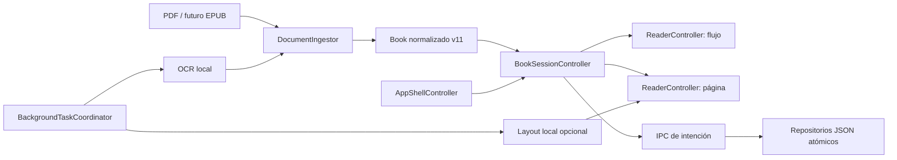

# Arquitectura de Lector

Este documento describe los límites que deben seguir siendo ciertos aunque
cambien la interfaz, el almacenamiento o el formato de entrada.

## Principios

- La lectura, extracción y OCR funcionan sin red.
- El `offset` de caracteres es el ancla canónica; línea, frase y región son
  representaciones transitorias.
- El renderer no accede a Node. Toda capacidad del sistema pasa por el puente
  mínimo de `electron/preload.cjs` y se valida en el proceso principal.
- Los formatos producen un `Book` normalizado. Los lectores no conocen pdf.js.
- El trabajo de un documento no puede actualizar otro documento abierto después.

## Componentes

### Proceso principal de Electron

`electron/main.js` crea la ventana endurecida, sirve `app://`, controla rutas
de PDF autorizadas, abre diálogos y registra IPC. `electron/storage.js` es la
única capa que conoce `userData`; serializa escrituras por fichero, escribe por
temporal y rename, valida las formas principales y conserva archivos corruptos.

### Adaptadores de documento

`src/document/pdfIngestor.js` implementa el adaptador PDF. Primero intenta la
ingesta en Worker y sólo cae al renderer si el Worker no puede arrancar. Un
adaptador EPUB futuro deberá entregar el mismo modelo normalizado.

El pipeline PDF vive en `src/pdf/`:

1. `extract.js` es la única frontera con pdf.js.
2. `lines.js` y `columns.js` reconstruyen renglones y orden de columnas.
3. `blocks.js` mide tipografía, quita mobiliario y forma párrafos/figuras.
4. `chapters.js` y `sections.js` detectan capítulos y material preliminar.
5. `pipeline.js` asigna offsets, páginas, estadísticas y `CACHE_VERSION`.

### Sesión y shell

`BookSessionController` posee entrada de biblioteca, documento abierto,
locator y escrituras pendientes. `BackgroundTaskCoordinator` entrega tokens de
sesión, cancela motores y descarta callbacks tardíos. `AppShellController`
gestiona exclusivamente vista, panel lateral y reposo del HUD.

`src/app.js` sigue siendo el composition root: construye esas piezas y traduce
eventos de UI en operaciones de aplicación; no debe recuperar reglas de
persistencia ni ciclos de vida propios.

### Lectores

Los lectores de flujo y página implementan `ReaderController`, definido en
`src/reader/readerContract.js`. Ambos reciben un `Book`, emiten progreso y
exponen locators; ninguno escribe almacenamiento directamente.

- Flujo remonta un capítulo en dos capas DOM idénticas y mide sus renglones con
  `Range.getClientRects()`.
- Página rasteriza el original y construye paradas desde bloques, renglones o
  detecciones de layout.

`BookSearchIndex` y `SpeechController` consumen el mismo libro y navegan sólo
mediante locators. El primero vive en memoria por sesión; el segundo acepta
exclusivamente voces declaradas locales. El diccionario carga shards ES/EN por
prefijo y su historial sólo existe si el lector lo activa.

`WellbeingController` cuenta actividad de ventana, no tiempo de reloj, y espera
un límite de unidad antes de avisar. El registro de estudio sólo se expone en
tareas de desarrollo y exporta manualmente.

### OCR y layout

Tesseract usa recursos vendorizados y guarda parciales cada cinco páginas. El
layout ONNX se activa sólo cuando el modelo local existe; actualmente no se
distribuye por incompatibilidad de licencia. Ambos pertenecen a la sesión y su
resultado se ignora si el usuario ya abrió otro libro.

## Flujo de apertura

1. El proceso principal lee el PDF elegido y calcula su ID por contenido.
2. El renderer busca caché y OCR persistido.
3. Una caché v11 válida abre directamente; una v10 se refina en sitio; las
   demás se reprocesan mediante `DocumentIngestor`.
4. Progreso y notas se reanclan contra texto/contexto cuando cambian offsets.
5. `BookSessionController` abre la sesión y guarda la entrada de biblioteca.
6. El modo por libro selecciona uno de los dos `ReaderController`.
7. OCR y layout comienzan en segundo plano con el token de esa sesión.
8. Al cerrar, lector, sesión, notas, ajustes y repositorios ejecutan `flush()`.

## Reglas para cambios

- Cambiar texto u offsets exige subir la versión de caché y definir migración o
  reproceso con reanclaje.
- Añadir un artefacto por libro exige incluirlo en borrado, respaldo y barrido.
- Añadir un método IPC exige validación en el proceso principal y una operación
  de intención en preload; no se expone `ipcRenderer`.
- Una tarea asíncrona por libro debe registrarse en el coordinador y proteger
  todos sus callbacks con el token de sesión.
- Toda escritura diferida debe tener `flush()` y una prueba de cierre inmediato.
